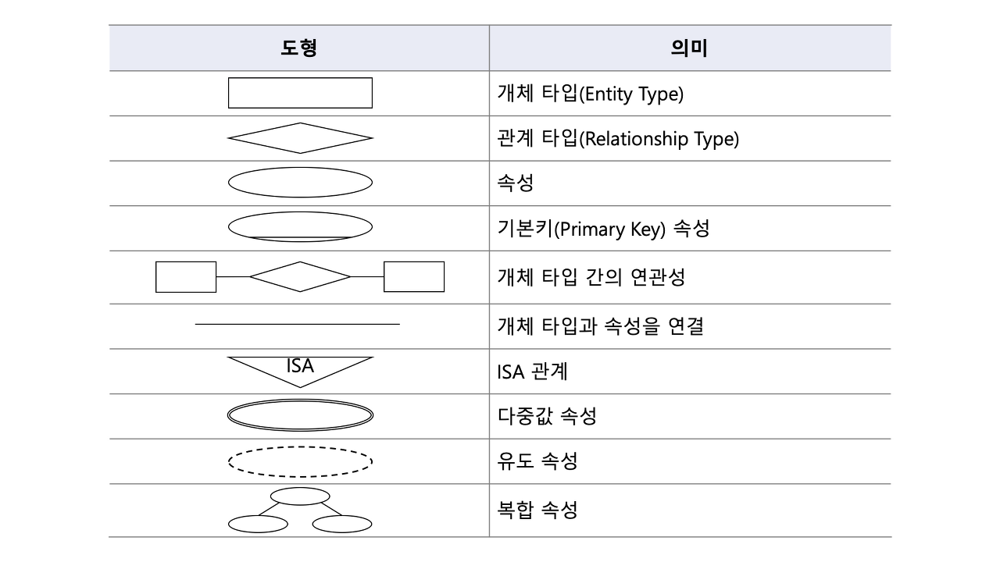

# 10장. 응용SW 기초기술 활용 (2)


## 데이터베이스 개념

업무를 수행하는 데 필요한 상호 관련된 데이터들의 모임

* **통합된 데이터** (Integrated Data) : 중복이 최소화된 데이터의 모임
* **저장된 데이터** (Stored Data) : 저장 매체에 저장된 데이터
* **운영 데이터** (Operational Data) : 업무를 수행하는 데 존재 가치가 확실하고 없어서는 안 될 반드시 필요한 데이터
* **공용 데이터** (Shared Data) : 여러 응용 시스템들이 공동으로 소유하고 유지하는 데이터


#### DBMS (DataBase Management System)

사용자와 데이터베이스 사이에서 사용자의 요구에 따라 정보를 생성해주고, 데이터베이스를 관리해 주는 소프트웨어이다.

* DBMS는 기존의 파일 시스템이 갖는 데이터의 종속성과 중복성의 문제를 해결하기 위해 제안된 시스템으로, 모든 응용 프로그램들이 데이터베이스를 공용할 수 있도록 관리해 준다.
* DBMS는 데이터베이스의 구성, 접근방법, 유지관리에 대한 모든 책임을 진다.
* DBMS의 필수 기능에는 정의 (Definition), 조작 (Manipulation), 제어 (Control) 기능이 있다.


#### DBMS의 종류

* **계층형 DBMS**

  > + 트리 구조를 이용해서 데이터의 상호관계를 계층적으로 정의한 DBMS이다.
  > + 개체 타입 간에는 상위(Owner)와 하위(Member) 관계까 존재하며, 일대다(1:N) 대응 관계만 존재한다.
  > + IMS, System2000 등

* **망형 DBMS**

  > + 그래프를 이용해서 데이터 논리 구조를 표현한 DBMS
  > + 상위(Owner)와 하위(Member) 레코드 사이에서 1:1, 1:N, N:M 대응관계를 모두 지원한다.
  > + IDS, TOTAL, IDMS 등

* **관계형 DBMS**

  > + 계층형 DBMS와 망형 DBMS의 복잡한 구조를 단순화시킨 DBMS이다.
  > + 파일 구조처럼 구성한 2차원적인 표(Table)를 하나의 DB로 묶어서 테이블 내에 있는 속성들 간의 관계(Relationship)를 설정하거나 테이블 간의 관계를 설정하여 이용한다.
  > + Oracle, SQL Server, MySQL 등

```
비관계형 DBMS (NoSQL DBMS)

데이터 간의 관계를 정의하지 않고 비구조적인 데이터를 저장하기 위한 시스템
	- 수평적 확장 및 분산 저장이 가능합니다.
	- 저장되는 데이터의 구조에 따라 Key-Value DBMS, Document DBMS, Graph DBMS 등으로 분류
```


#### DBMS의 장∙단점

| 장점                                               | 단점                                               |
| -------------------------------------------------- | -------------------------------------------------- |
| - 데이터의 논리적, 물리적 독립성이 보장된다.       | - 데이터베이스의 전문가가 부족하다.                |
| - 데이터의 중복을 피할 수 있어 기억공간이 절약된다 | - 전산화 비용이 증가한다.                          |
| - 저장된 자료를 공동으로 이용할 수 있다.           | - 대용량 디스크로의 집중적인 Access로              |
| - 데이터의 일관성을 유지할 수 있다.                | 과부하 (Overhead)가 발생한다.                      |
| - 데이터의 무결성을 유지할 수 있다.                | - 파일의 예비 (Backup)와 회복 (Recovery)이 어렵다. |
| - 보안을 유지할 수 있다                            | - 시스템이 복잡하다.                               |
| - 데이터를 표준화할 수 있다.                       |                                                    |
| 데이터를 통합하여 관리할 수 있다.                  |                                                    |
| - 항상 최신의 데이터를 유지한다.                   |                                                    |
| - 데이터의 실시간 처리가 가능하다.                 |                                                    |


***


## ER (Entity Relationship) 모델

개념적 데이터 모델의 가장 대표적인 것. 개체, 속성, 관계 등에 대하여 용이하게 표현할 수 있는 ER 도형 (ERD; Entity Relationship Diagram) 을 정의하고 있다.


#### ER 도형

ER모델은 몇 가지 도형들을 이용하여 현실 세계를 표현한다.



```
ISA관계
- 상위개체와 하위개체 간의 관계를 의미한다. 예를들어 학생개체는 내부적으로 재학생, 휴학생, 졸업생 개체로 구별된다.
```


#### 개체 및 개체 타입

* 개체는 현실 세계의 객체로서 유형 또는 무형의 정보 대상으로 존재하며 서로 구별될 수 있는 것을 뜻하고 개체의 특성을 나타내는 속성을 갖는다.
* 하나의 개체를 개체 어커런스 (Entity Occurence) 도는 개체 인스턴스 (Entity Instance)라 하고, 개체 어커런스들의 집합에 대한 공통의 특성들을 갖는 개체 클래스를 개체 타입이라 한다.


#### 관계 및 관계타입

* 관계는 2개 이상의 개체 사이에 존재하는 연관성을 뜻하며, 관계타입은 같은 관계들의 집합 또는 틀을 뜻한다.

* 관계는 관계에 참여하는 개체 타입의 개수에 대한 차수 (Degree)와 관계에 참여하는 개체 어커런스의 개수에 대한 대응 카디널리티 (Mapping Cardinality)를 갖는다.

* 차수에 따른 관계의 종류

  > + 단항 (Unary) 관계 : 관계에 참여하고 있는 개체타입이 1개인 관계
  > + 이항 (Binary) 관계 : 관계에 참여하고 있는 개체타입이 2개인 관계
  > + 삼항 (Ternary) 관계 : 관계에 참여하고 있는 개체 타입이 3개인 관계
  > + n항 (n-ary) 관계 : 관계에 참여하고 있는 개체 타입이 n개인 관계

* 대응 카디널리티에 따른 관계의 종류

  > + 1:1 관계 : 관계에 참여하고 있는 두 개체 타입이 모두 하나씩의 개체 어커런스를 갖는 관계
  > + 1:N 관계 : 관계에 참여하고 있는 개체 타입 중 한 개체 타입은 여러 개의 개체 어커런스를 가질 수 있고, 다른 한 개체 타입은 하나의 개체 어커런스를 갖는 관계
  > + N:M 관계 : 두 개체 타입 모두 여러개의 개체 어커런스를 가질 수 있는 관계


#### 속성

* 속성은 개체의 특성이나 상태를 기술한 것이다. 관계 역시 개체와 마찬가지로 속성을 가질 수 있다.
* 속성이 가질 수 있는 모든 가능한 값들의 집합을 **`도메인`** (Domain) 이라 한다.
* 모든 개체 타입은 그 개체를 유일하게 식별해 주는 기본키에 속하는 속성을 포함한다.
* 속성에는 더 이상 다른 속성으로 나눌 수 없는 단순속성 (Simple Attribute) 과 2개 이상의 속성들로 분해할 수 있는 복합속성 (Composite Attribute) 이 있다.


***


## 관계형 데이터 모델

데이터를 테이블 (Table) 또는 릴레이션 (Relation) 의 구조로 표현하는 논리적 데이터 모델이다.


#### 관계형 데이터 구조 :: 릴레이션

* 관계형 데이터 모델에서는 데이터를 원자 값 (Atimic Value) 으로 갖는 이차원의 테이블로 표현하는데, 이를 릴레이션이라 한다.
* 릴레이션의 구조는 물리적인 저장 구조를 나타내는 것이 아닌 논리적 구조이므로 다양한 정렬 기준을 통하여 릴레이션을 표현할 수 있다.
* 릴레이션은 구조를 나타내는 릴레이션 스키마 (Relation Schema) 와 실제 값들인 릴레이션 인스턴스 (Relation Instance) 로 구성된다.
* 릴레이션의 열 (Column)을 **`속성`** (Attribute) 이라 하고, 행 (Row) 을 **`튜플`** (Tuple) 이라 한다.
* 릴레이션에서 하나의 애트리뷰트가 취할 수 있는 같은 타입의 원자 (Atomic) 값들의 집합을 **`도메인`** (Domain)이라 한다. 도메인은 실제 애트리뷰트 값이 나타날 때 그 값의 합법 여부를 시스템이 검사하는 데에도 이용된다.


#### ER 모델을 관계형 데이터 모델로 변환

개념적 데이터 모델인 ER모델을 논리적 데이터 모델인 릴레이션 스키마로 변환하는 것으로, 매핑 룰 (Mapping Rule) 이라고도 한다.

* 속성은 컬럼 (Column) 으로, 식별자는 기본키로 표현하고, 릴레이션 간의 관계는 기본키와 이를 참조하는 외래키 (Foreign Key) 를 이용하여 표현한다.

* 개체 A, B와 관계 Y로 이루어진 ER 모델을 관계형 데이터 모델에서의 릴레이션 스키마로 변환하는 과정은 다음과 같다.

  > + 개체 A, B는 각각 독립적인 릴레이션 A, B로 표현된다. Ehgks, ER 도형에서의 각 개체의 속성들은 각 릴레이션의 속성들로 정의되고, 기본키는 밑줄을 그어 표시한다.
  > + 관계 Y가 1:1 관계이면, 릴레이션 A의 기본키를 릴레이션 B의 외래키로 추가하거나 릴레이션 B의 기본키를 릴레이션 A의 외래키로 추가하여 표현한다.
  > + 관계 Y가 1:N 관계이면, 릴레이션 A의 기본키를 릴레이션 B의 외래키로 추가하여 표현한다.
  > + 관계 Y가 N:M 관계이면, 릴레이션 A와 B의 기본키를 모두 포함한 별도의 릴레이션으로 표현한다. 이때 생성된 별도의 릴레이션을 교차 릴레이션 (Intersection Relation) 또는 교차 엔티티 (Intersection Entity) 라고 한다.


***


## 키의 개념 및 종류

키 (Key) 란 데이터베이스에서 조건에 만족하는 튜플을 찾거나 순서대로 정렬할때 기준이 되는 속성을 말한다.


#### 슈퍼키 (Super Key)

슈퍼키는 한 릴레이션 내에 있는 속성들의 집합으로 구성된 키를 말한다. 

릴레이션을 구성하는 모든 튜플 중 슈퍼키로 구성된 속성의 집합과 동일한 값은 나타나지 않는다.

> + 슈퍼키는 릴레이션을 구성하는 모든 튜플에 대해 유일성은 만족하지만, 최소성은 만족하지 못한다.


#### 후보키 (Candidate Key)

릴레이션을 구성하는 속성들 중에서 튜플을 유일하게 식별하기 위해 사용되는 속성들의 부분집합이다.

> + 후보키는 유일성과 최소성을 모두 만족한다.
>
> + (학번, 과목명) 과 같이 2개 이상의 필드를 조합하여 만든 키를 복합키 (Composite Key) 라고 한다.


#### 기본키 (Primary Key)

기본키는 후보키 중에서 특별히 선정된 키로 중복된 값을 가질 수 없다.

> + 유일성과 최소성을 가지며 튜플을 식별하기 위해 반드시 필요한 키이다.
> + 기본키는 NULL 값을 가질 수 없다. 즉 튜플에서 기본키로 설정된 속성에는 NULL 값이 있어서는 안 된다.


#### 대체키 (Alternate Key)

대체키는 후보키 중에서 선정된 기본키를 제외한 나머지 후보키를 의미한다.


#### 외래키 (Foreign Key)

외래키는 다른 릴레이션의 기본키를 참조하는 속성 또는 속성들의 집합을 의미한다.

> * 외래키는 릴레이션 간의 관계를 표현할 때 사용한다.
> * 한 릴레이션에 속한 속성 A와 참조 릴레이션의 기본키인 B가 동일한 도메인상에서 정의되었을 때의 속성 A를 외래키라고 한다.
> * 외래키는 참조 릴레이션의 기본키와 동일한 키 속성을 가진다.


***


## 무결성

무결성이란 데이터베이스에 저장된 데이터 값과 그것이 표현하는 현실 세계의 실제값이 일치하는 정확성을 의미한다.

* 무결성 제약조건은 데이터베이스에 들어 있는 데이터의 정확성을 보장하기 위해 부정확한 자료가 데이터베이스 내에 저장되는 것을 방지하기 위한 제약조건을 말한다.
* 무결성의 종류에는 개체 무결성, 도메인 무결성, 참조 무결성, 사용자 정의 무결성, NULL 무결성, 고유 무결성, 키 무결성, 관계 무결성 등이 있다.


#### 개체 무결성 (Entity Integrity, 실체 무결성)

개체 무결성은 기본 테이블의 기본키를 구성하는 어떤 속성도 NULL 값이나 중복값을 가질 수 없다는 규정이다.

#### 도메인 무결성 (Domain Integrity, 영역 무결성)

도메인 무결성은 주어진 속성 값이 정의된 도메인에 속한 값이어야 한다는 규정이다.

#### 참조 무결성 (Referential Integrity)

참조 무결성은 외래키 값은 Null이거나 참조 릴레이션의 기본키 값과 동일해야 한다. 즉 릴레이션은 참조할 수 없는 외래키 값을 가질 수 없다는 규정이다.

> 외래키와 참조하려는 테이블의 기본키는 도메인과 속성 개수가 같아야 한다.

#### 사용자 정의 무결성

속성 값들이 사용자가 정의한 제약조건에 만족해야 한다는 규정이다.

#### NULL 무결성

특정 속성 값이 NULL 이 될 수 없도록 하는 규정이다.

#### 고유 (Unique) 무결성

릴레이션의 특정 속성에 대해 각 튜플이 갖는 속성값들이 서로 달라야 한다는 규정이다.

#### 키 (Key) 무결성

하나의 릴레이션에는 적어도 하나의 키가 존재해야 한다는 규정이다.

#### 관계 (Relationship) 무결성

릴레이션에 어느 한 튜플의 삽입 가능 여부 또는 한 릴레이션과 다른 릴레이션의 튜플들 사이의 관계에 대한 적절성 여부를 지정한 규정이다.